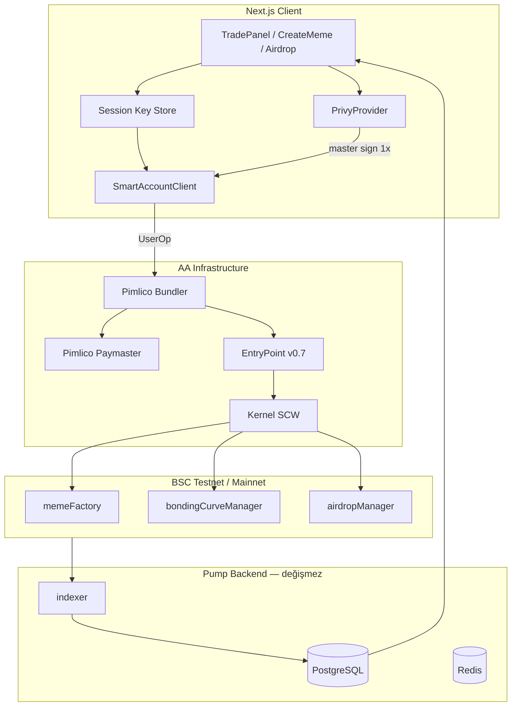

# Pump TMA — Sorunsuz Web3 UX Araştırması (Haziran 2026)

> **Amaç:** Uygulamayı “kustodial görünümlü ama aslında non-custodial” durumundan, pump.fun seviyesinde **uygulama içi, popup'sız, tek dokunuşlu** Web3 deneyimine taşımak.  
> **Kapsam:** BSC testnet (şimdi) → BSC mainnet → çok zincir (sonra).  
> **Doğrulama:** Web araması, resmi dokümantasyon, Context7 (`/websites/privy_io`, `/websites/zerodev_app`, `/pimlicolabs/permissionless.js`). POC gerektiren maddeler ⚠️ ile işaretlendi.

---

## 1. Yönetici Özeti ve Önerilen Yığın

### Hedef UX

Kullanıcı bir kez e-posta / sosyal / passkey ile giriş yapar, bir kez “Pump'ta işlem yap” izni verir; sonrasında token oluşturma, airdrop, al/sat **uygulama içinde, cüzdan eklentisi popup'ı olmadan** çalışır.

### Önerilen yığın

| Katman | Seçim | Gerekçe |
|--------|-------|---------|
| Kimlik & kök imzalayıcı | [Privy](https://docs.privy.io/) | pump.fun referansı; email/social/passkey; TEE + Shamir self-custodial |
| Akıllı hesap | [ZeroDev Kernel v3](https://docs.zerodev.app/) (EntryPoint **0.7**) | En olgun session key / permissions; BSC testnet + mainnet |
| Bundler + Paymaster | [Pimlico](https://docs.pimlico.io/) | BSC resmi destek; Privy + permissionless recipe kanıtlı |
| İstemci SDK | `permissionless` + `@zerodev/sdk` + `@zerodev/permissions` | UserOp, batch, gas sponsor |
| Mevcut stack | wagmi 2 + viem 2 | Read katmanı korunur; write → SmartAccountClient |

**Failover:** ZeroDev bundler/paymaster (testnet kredileri ücretsiz).  
**Faz 3 çok zincir:** Particle [Universal Accounts](https://developers.particle.network/intro/universal-accounts) veya ZeroDev chain abstraction — BSC fazı bitene kadar ertele.

### Doğrulama durumu

| Konu | Durum |
|------|--------|
| Pimlico BSC + testnet bundler | ✅ [Supported Chains](https://docs.pimlico.io/guides/supported-chains), [MetaMask bundler](https://docs.metamask.io/services/concepts/bundler/) |
| EntryPoint v0.7 BSC | ✅ [erc4337.io](https://docs.erc4337.io/core-standards/erc-4337.html) |
| ZeroDev session keys BSC | ✅ [Permissions](https://docs.zerodev.app/smart-accounts/permissions/intro) |
| Privy → Kernel SCW | ✅ [Smart wallets](https://docs.privy.io/wallets/using-wallets/evm-smart-wallets/overview) |
| pump.fun Privy + gasless | ✅ [Helius](https://www.helius.dev/blog/web3-ux), [CryptoSlate](https://cryptoslate.com/decentralized-exchanges/pump-fun-review/) |
| Bonding curve + session policy | ⚠️ POC |
| AppKit → Privy migration | ⚠️ POC |
| Paymaster maliyet/limit BSC testnet | ⚠️ POC |

---

## 2. Mevcut Durum vs Hedef — Boşluk Analizi

### Bugün pump-tma'da

```
Kullanıcı → Reown AppKit (email/social/wallet) → EOA
         → wagmi useWriteContract / useSignTypedData
         → Cüzdan popup (MetaMask / embedded signer)
         → BSC tx → indexer → UI
```

**Kod:** `src/lib/appkit.ts`, `WalletBar.tsx`, `TradePanel.tsx`, `CreateMemeForm.tsx`, `CreateAirdropForm.tsx`

### “Kustodial görünümlü non-custodial”

| Kustodial gibi | Gerçekte |
|----------------|----------|
| Header `$123.45` bakiye | On-chain BNB formatı |
| Deposit / Buy modalları | Kullanıcının kendi adresine transfer |
| Avatar, favorites | PostgreSQL off-chain UX |
| Connect wallet | Harici veya AppKit embedded EOA |

**Asıl sorun:** Her `writeContract` / `signTypedData` → **cüzdan popup**.

### Hedef

```
Privy login → Kernel SCW → İlk tx: session key onayı (1×)
           → Sonraki tx: session key UserOp (popup YOK)
           → Paymaster gas → indexer (değişmez)
```

### Boşluk matrisi

| Yetenek | Bugün | Hedef |
|---------|-------|-------|
| Popup'sız tx | ❌ | ✅ Session key |
| Gasless | ❌ | ✅ Paymaster |
| Batch approve+buy | Kısmen (permit) | ✅ Tek UserOp |
| Bir daha sorma | ❌ | ✅ Scoped session |
| Passkey | ❌ | ✅ WebAuthn |
| Multi-chain | ❌ | Faz 3 |

---

## 3. Teknoloji Derin Dalışları

### 3.1 ERC-4337

- **UserOperation:** Bundler mempool → EntryPoint validate/execute
- **Paymaster:** Gas sponsor veya ERC-20 ile ödeme
- **Batching:** Tek imzada çoklu call
- **EntryPoint v0.7:** `0x0000000071727De22E5E9d8BAf0edAc6f37da032` — BSC dahil major chain'ler

Kaynak: [erc4337.io](https://docs.erc4337.io/core-standards/erc-4337.html), [MetaMask bundler](https://docs.metamask.io/services/concepts/bundler/)

### 3.2 Privy

- Embedded wallet: TEE + Shamir; export mümkün
- Smart wallet: Kernel, Safe, Biconomy, Alchemy, Coinbase SW seçilebilir
- BSC: EVM genel destek; chain parametresi ile AA recipe
- Fiyat: Free 0–499 MAU, 50K imza/ay; Core $299/ay; Scale $499/ay — [privy.io/pricing](https://www.privy.io/pricing)
- Stripe satın alımı (2025): fintech entegrasyonu

Kaynak: [Embedded wallets](https://docs.privy.io/wallets/overview/embedded), [Smart wallets](https://docs.privy.io/wallets/using-wallets/evm-smart-wallets/overview)

### 3.3 ZeroDev Kernel

- **Permissions:** signer + policy + action ([intro](https://docs.zerodev.app/smart-accounts/permissions/intro))
- Policy: Call whitelist, gas limit, rate limit, timestamp
- Passkeys: BSC native precompile listesinde ([passkeys](https://docs.zerodev.app/onboarding/passkeys/overview))
- EIP-7702: `eip7702Account` ile session key ([tutorial](https://docs.zerodev.app/smart-accounts/permissions/transaction-automation))
- Fiyat: Developer $0 (50K testnet credit); Growth $69/ay; Scale $399/ay — [zerodev.app/pricing](https://zerodev.app/pricing)

### 3.4 Pimlico

- RPC: `https://api.pimlico.io/v2/bsc/rpc?apikey=...` (mainnet), `.../97/...` (testnet)
- Public: `https://public.pimlico.io/v2/{chain_id}/rpc` — prototip
- USDT ERC-20 paymaster BNB'de — [supported tokens](https://docs.pimlico.io/references/paymaster/erc20-paymaster/supported-tokens)
- Client: `permissionless` + `createPimlicoClient`

### 3.5 Particle Network

- **Universal Accounts:** tek hesap, tek bakiye, çok zincir — [docs](https://developers.particle.network/intro/universal-accounts)
- **Omnichain Paymaster:** USDT deposit BNB/Ethereum; testnet ücretsiz — [paymaster guide](https://developers.particle.network/aa/guides/paymaster)
- EIP-7702 ile mevcut EOA upgrade
- **Pump için:** Faz 3; Faz 1'de gereksiz karmaşıklık

### 3.6 Session Keys

**“Bir daha sorma” pattern:**

1. Master (Privy embedded / passkey) bir kez session key'i onaylar
2. Session key sadece whitelist kontrat/fonksiyon + gas cap + expiry
3. Uygulama session key ile UserOp imzalar — harici popup yok
4. Süre dolunca veya revoke → tekrar master onay

**Güvenlik:** Session key localStorage'da — XSS riski; HttpOnly cookie veya IndexedDB + CSP zorunlu ([CertiK passkey analizi](https://www.certik.com/blog/security-considerations-for-passkey-based-web3-wallets))

ZeroDev: `paymaster` flag session key'de zorunlu tutulmalı (gas drain saldırısı) — [session keys docs](https://docs.zerodev.app/smart-accounts/permissions/session-keys)

### 3.7 Passkeys / WebAuthn

- P-256 (secp256r1) anahtar; Secure Enclave / TPM
- BSC: RIP-7212 / EIP-7951 native precompile — ZeroDev chain listesinde BSC
- Ethereum mainnet: EIP-7212 precompile (Fusaka, Aralık 2025) — [p256-verifier demo](https://github.com/omarespejel/p256-verifier)
- UX: Face ID / Touch ID / Windows Hello — OS seviyesi prompt (MetaMask popup değil)

### 3.8 BSC + AA Maturity

| Bileşen | Durum (2026) |
|---------|--------------|
| EntryPoint v0.7 | ✅ Deployed |
| Pimlico bundler BSC + testnet | ✅ |
| MetaMask bundler BSC | ✅ |
| ZeroDev Kernel BSC | ✅ |
| Passkey precompile BSC | ✅ |
| Ecosystem olgunluğu vs Base/Ethereum | ⚠️ Daha az hacim; POC şart |

### 3.9 Rakip Pattern'ler

**pump.fun (Solana, Privy):**
- Email/social → embedded wallet otomatik
- Gasless: backend managed wallet fee payer + user imza ([Helius](https://www.helius.dev/blog/web3-ux))
- Mobil tek dokunuş; milyon $ hacim popup'sız

**friend.tech:** Farcaster social graph + embedded wallet; tek tık buy — social login öncelikli onboarding.

**Genel launchpad dersi:** Embedded wallet + gas sponsor + session/delegated signing = consumer UX. Harici cüzdan opsiyonel kalır (power user).

---

## 4. Karşılaştırma Matrisi

| Kriter | Privy + ZeroDev + Pimlico | Privy-only (dashboard SCW) | Particle UA | Reown AppKit (mevcut) |
|--------|---------------------------|----------------------------|-------------|----------------------|
| Popup'sız tx | ✅ Session keys | ⚠️ Sınırlı granularite | ✅ | ❌ |
| BSC testnet | ✅ | ✅ | ✅ | ✅ (EOA) |
| Session key scope | ✅ ZeroDev policies | ⚠️ | ⚠️ | ❌ |
| Passkey | ✅ Privy + ZeroDev | ✅ | ✅ | ⚠️ |
| Gas sponsor | ✅ Pimlico | ✅ Dashboard URL | ✅ Omnichain PM | ❌ |
| Multi-chain | Faz 3 | Orta | ✅ Native | Düşük |
| Vendor lock-in | Orta | Orta-yüksek | Yüksek | Düşük |
| Dev effort | Orta-yüksek | Düşük | Orta | — (mevcut) |
| Maliyet (başlangıç) | Privy free + Pimlico testnet | Privy free | Testnet free | Mevcut WC |
| pump.fun benzeri | ✅ En yakın (EVM) | ⚠️ | ⚠️ Overkill Faz 1 | ❌ |

---

## 5. Önerilen Mimari



### Katman sorumlulukları

| Katman | Sorumluluk |
|--------|------------|
| Privy | Auth, embedded EOA signer, opsiyonel passkey |
| Kernel SCW | Varlık tutma; session key validation on-chain |
| Session key | Scoped trade/create imzaları (client-side) |
| Pimlico | UserOp relay + gas sponsor |
| wagmi/viem | `readContract`, bakiye, quote simülasyonu |
| Indexer/DB | Trade tape, arena, portfolio — **değişmez** |

### Env

**Server:**
```bash
PRIVY_APP_SECRET=...
PIMLICO_API_KEY=...
SESSION_KEY_ENCRYPTION_SECRET=...
PAYMASTER_DAILY_BUDGET_USD=...
```

**Client:**
```bash
NEXT_PUBLIC_PRIVY_APP_ID=...
NEXT_PUBLIC_CHAIN_ID=97
```

### Dosya planı

```
src/lib/aa/
  kernel-account.ts
  session-permissions.ts
  pimlico-client.ts
  session-storage.ts
src/hooks/useSmartAccount.ts, useSessionTrade.ts
src/components/wallet/SessionGrantModal.tsx, PrivyProvider.tsx
src/app/api/aa/sponsor/route.ts   # opsiyonel
```

---

## 6. Kullanıcı Akışları (Metin Wireframe)

### 6.1 İlk giriş + session grant

```
[Connect] → Privy sheet: Email | Google | Passkey
→ "Hesabın hazır" (SCW adresi arka planda)
→ SessionGrantModal:
    "Pump'ta hızlı işlem"
    ☑ 7 gün boyunca al/sat ve token oluştur (max 0.05 BNB/gün gas)
    [İzin ver — Face ID]  [Her seferinde sor]
→ Master imza (1× OS biyometrik — MetaMask DEĞİL)
→ Session key kaydedildi → Arena
```

### 6.2 Token oluştur (Create)

```
/create → form doldur → [Launch]
→ Session key UserOp: memeFactory.createMeme + opsiyonel initial buy
→ Paymaster gas
→ In-app: "Confirming…" → TokenLaunchSuccessModal
→ Indexer token'ı listeler
```

**Batch:** create + initial buy tek UserOp.

### 6.3 Airdrop oluştur

```
/airdrops/create → form → [Create campaign]
→ Session key → airdropManager.create...
→ Gas sponsor
→ Success → detail panel
```

### 6.4 Al / Sat (Trade)

```
/token/[addr] → amount → [Buy]
→ Session key UserOp → bondingCurveManager.buy
→ ~2–5 sn → Trade tape fill (price-accuracy-contract: fill ≠ quote normal)

[Sell] → permit batch veya session sell — popup YOK
```

**Yetersiz bakiye:** Mevcut `WalletFundingModal` (Deposit / Buy with card).

### 6.5 Session süresi doldu

```
[Buy] → "İzin süresi doldu" → SessionGrantModal tekrar
```

---

## 7. Güvenlik Modeli ve Trade-off'lar

### Custody

| Bileşen | Custody |
|---------|---------|
| Privy embedded key | Self-custodial (TEE + Shamir); export mümkün |
| Kernel SCW | Kullanıcı SCW'si; kontrat kodu on-chain |
| Session key | Delegated; scope ile sınırlı |
| Paymaster | Pump treasury; sadece gas — kullanıcı fonlarına erişemez |

### Session key scope (önerilen)

```typescript
// src/lib/aa/session-permissions.ts — POC'de finalize
targets: [
  contracts.memeFactory,
  contracts.bondingCurveManager,
  contracts.airdropManager,
]
policies: [
  callPolicy({ selectors: ALLOWED_SELECTORS }),
  gasPolicy({ maxGasPerUserOp: MAX_GAS }),
  rateLimitPolicy({ count: 30, interval: 3600 }),
  timestampPolicy({ validUntil: now + 7 * 86400 }),
]
paymaster: REQUIRED  // gas drain koruması
```

### Recovery

- Passkey + Privy social recovery
- SCW guardian modülü (ZeroDev) — Faz 2
- Export private key — Privy escape hatch

### Tehdit modeli

| Tehdit | Azaltma |
|--------|---------|
| XSS → session key çalınması | CSP, strict nonce, kısa TTL, düşük gas cap |
| Paymaster drain | Server webhook + günlük budget |
| Session key scope escape | On-chain call policy audit |
| Vendor outage | Pimlico ↔ ZeroDev failover |

---

## 8. Uygulama Fazları

### Faz 0 — POC (1–2 hafta) ⚠️

- [ ] Privy + Kernel + Pimlico BSC testnet
- [ ] Tek `buy` UserOp bonding curve'de
- [ ] Session key grant + 10 ardışık trade popup'sız
- [ ] Paymaster maliyet ölçümü

### Faz 1 — BSC Testnet Beta

- [ ] AppKit → Privy migration
- [ ] TradePanel, CreateMemeForm, CreateAirdropForm → session path
- [ ] SessionGrantModal ("bir daha sorma")
- [ ] UserBootstrap → SCW adresi
- [ ] Harici cüzdan: legacy EOA path (opsiyonel)

### Faz 2 — BSC Mainnet

- [ ] Pimlico production API + paymaster budget
- [ ] Passkey login opsiyonu
- [ ] Guardian recovery
- [ ] Sponsorship webhook (anti-abuse)

### Faz 3 — Multi-chain

- [ ] Particle UA veya ZeroDev chain abstraction değerlendirmesi
- [ ] `pumpChain` → multi-chain config
- [ ] Cross-chain deposit UX

### TradePanel migration notu

```typescript
// Önce
writeContract({ address, abi, functionName: "buy", args, value });

// Sonra
await smartAccountClient.sendTransaction({
  calls: [{ to: contracts.bondingCurveManager, data: encodeBuy(...), value: bnbWei }],
});
```

---

## 9. Riskler ve Web'de Mümkün Olmayanlar

### Elimine edilemeyen popup'lar

| Durum | Popup |
|-------|-------|
| İlk passkey kaydı | ✅ OS WebAuthn (Face ID) — kabul edilebilir |
| Session grant (master imza) | ✅ OS/Privy embedded (1× / 7 gün) |
| Session key ile trade | ❌ Harici cüzdan yok |
| On-ramp (kart) | ✅ KYC / 3DS — partner zorunlu |
| İlk SCW deploy | ❌ UserOp içinde (initCode) |
| Harici MetaMask (legacy) | ✅ MetaMask popup — bilinçli seçim |

### BSC AA sınırlamaları

- Ecosystem hacmi Base/Ethereum'dan düşük — bundler latency POC ile ölçülmeli
- ERC-20 paymaster BSC'de USDT sınırlı — verifying paymaster (BNB treasury) daha pratik
- EntryPoint 0.6 vs 0.7 — **0.7** seç; eski tooling'den kaçın

### Maliyet riski

- Yoğun trade → paymaster BNB drain; rate limit + webhook şart
- Privy MAU / imza limitleri — [pricing](https://www.privy.io/pricing)

### Teknik borç

- SCW adresi ≠ eski EOA — migration banner gerekir
- Indexer `address` alanları SCW'ye güncellenmeli

---

## 10. Karar Kaydı (ADR)

### Karar

**Privy + ZeroDev Kernel v3 + Pimlico** — BSC testnet'ten başlayarak pump-tma AA geçişi.

### Gerekçe

1. **pump.fun kanıtı:** Privy embedded + gasless = hedef UX'in endüstri referansı
2. **Session keys:** ZeroDev permissions en granular "bir daha sorma" modeli
3. **BSC:** Üç sağlayıcı da BSC testnet/mainnet destekliyor (doğrulandı)
4. **Vendor bağımsızlığı:** Kernel + Pimlico standardı; Privy auth değişse SCW kalır
5. **Mevcut stack:** wagmi/viem/indexer korunur; sadece write path değişir

### Reddedilen alternatifler

| Alternatif | Neden red |
|------------|-----------|
| AppKit + AA patch | Session key yok; embedded hâlâ popup |
| Privy-only (no ZeroDev) | Session scope yetersiz |
| Particle UA (Faz 1) | Chain abstraction erken; lock-in |
| Biconomy-only | ZeroDev permissions daha olgun pump use-case için |
| Saf EIP-7702 (EOA upgrade) | BSC 7702 olgunluğu POC gerektirir; 4337 daha öngörülebilir |

### Sonraki adım

Faz 0 POC: BSC testnet'te `bondingCurveManager.buy` + session key + Pimlico sponsor.

---

## Referanslar

| Kaynak | URL |
|--------|-----|
| Privy docs | https://docs.privy.io/ |
| Privy smart wallets | https://docs.privy.io/wallets/using-wallets/evm-smart-wallets/overview |
| Privy pricing | https://www.privy.io/pricing |
| ZeroDev docs | https://docs.zerodev.app/ |
| ZeroDev permissions | https://docs.zerodev.app/smart-accounts/permissions/intro |
| ZeroDev passkeys | https://docs.zerodev.app/onboarding/passkeys/overview |
| ZeroDev pricing | https://zerodev.app/pricing |
| Pimlico docs | https://docs.pimlico.io/ |
| Pimlico supported chains | https://docs.pimlico.io/guides/supported-chains |
| permissionless.js | https://github.com/pimlicolabs/permissionless.js |
| Particle Universal Accounts | https://developers.particle.network/intro/universal-accounts |
| Particle Paymaster | https://developers.particle.network/aa/guides/paymaster |
| ERC-4337 spec | https://docs.erc4337.io/core-standards/erc-4337.html |
| pump.fun UX (Helius) | https://www.helius.dev/blog/web3-ux |
| Passkey security (CertiK) | https://www.certik.com/blog/security-considerations-for-passkey-based-web3-wallets |
| Price accuracy (Pump) | `.cursor/docs/price-accuracy-contract.md` |

---

*Belge sürümü: 2026-06-19 · pump-tma repo*
