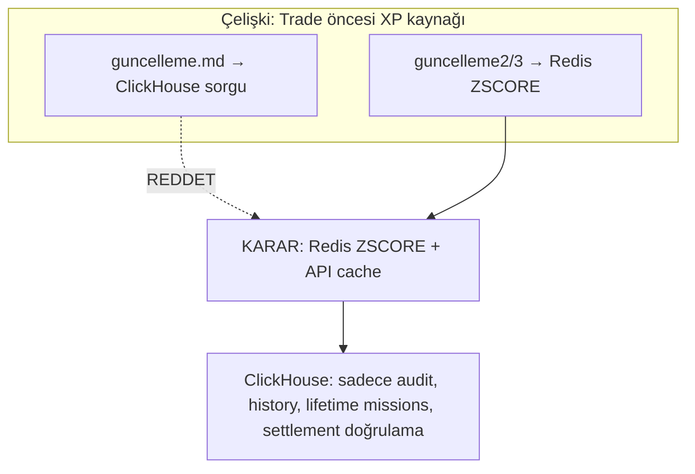
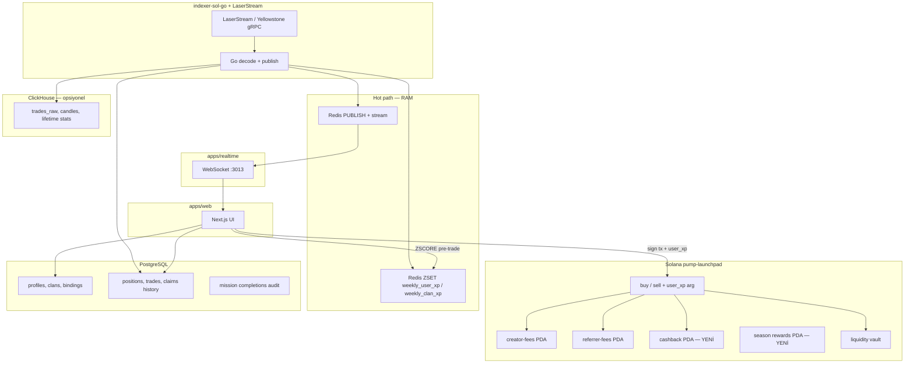
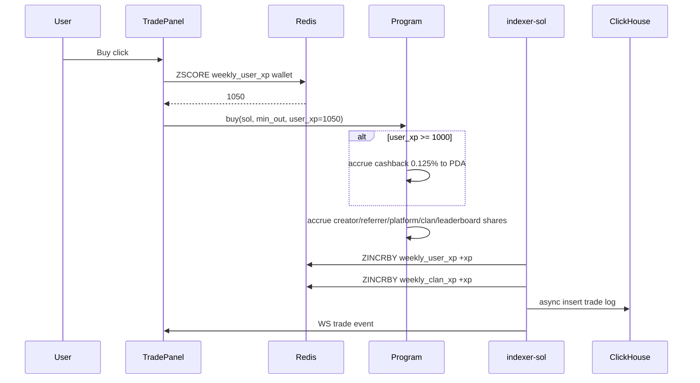
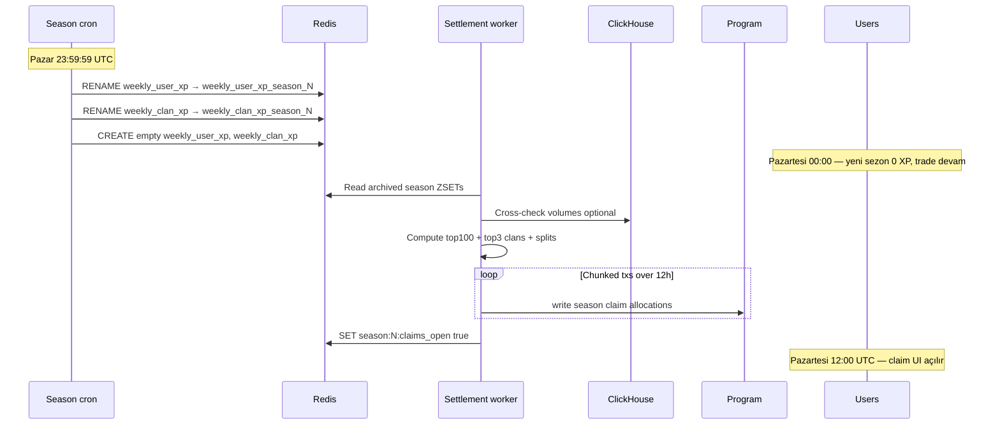
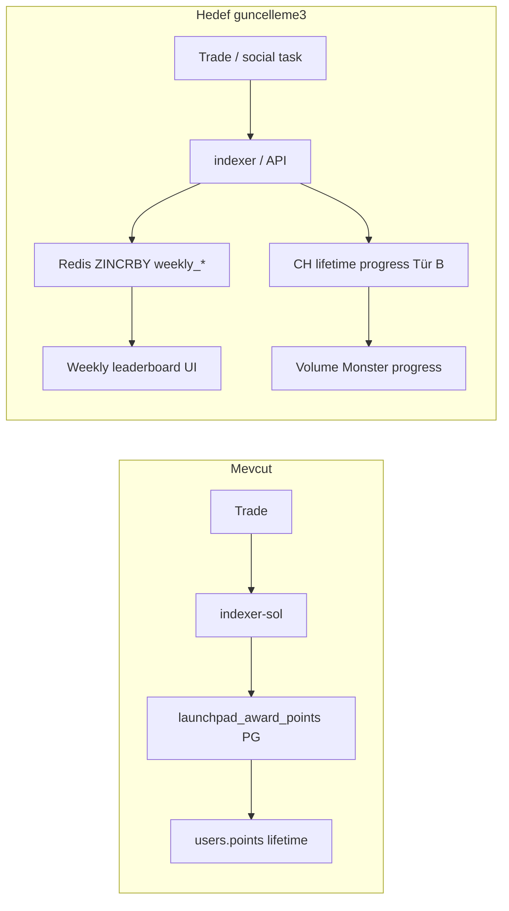

# Güncelleme Dosyaları — Analiz, Karşılaştırma ve Uygulama Planı

**Tarih:** 2026-07-23  
**Kaynaklar:** [`guncelleme.md`](../guncelleme.md) · [`guncelleme2.md`](../guncelleme2.md) · [`guncelleme3.md`](../guncelleme3.md)  
**Referans mimari:** [`proje-mimari-2026.md`](./proje-mimari-2026.md) · [`ops-perf-playbook.md`](./ops-perf-playbook.md) · [`solana-stack-plan.md`](./solana-stack-plan.md)

> **Uygulama planı (canonical):** [`guncelleme-master-plan.md`](./guncelleme-master-plan.md) — F0–F8, Go indexer + LaserStream dahil.  
> **İlerleme günlüğü:** [`guncelleme-ilerleme.md`](./guncelleme-ilerleme.md) — her faz sonrası LOG buraya.

---

## Executive summary

Üç güncelleme dosyası **aynı ürün vizyonunu** (haftalık XP yarışması, klan, %1.25 fee’nin 6’ya bölünmesi, manuel SOL claim, ultra-düşük VM yükü) farklı katman detaylarıyla anlatıyor. **guncelleme.md** ile **guncelleme2.md** arasında **kritik bir çelişki** var (trade öncesi XP kaynağı: ClickHouse vs Redis). **guncelleme3.md** en olgun versiyon — sezon geçişi (`RENAME`), tampon settlement ve portfolio/missions ayrımını ekliyor.

**Mevcut projede zaten var olanlar:** %1.25 protocol fee, creator/referrer pending PDA + manuel claim, PG missions/points, Redis pub/sub + WS, opsiyonel ClickHouse dual-write, portfolio/on-chain holdings, indexer-sol RPC pipeline.

**Henüz yok (3 dosyanın ortak hedefi):** Klan sistemi, haftalık XP Redis ZSET, on-chain cashback, klan/leaderboard haftalık havuz claim, UI→program `user_xp` parametresi, LaserStream/Go indexer, Jupiter price worker, PG’den XP yükünü kaldırma (kısmen), sezon settlement job.

**Önerilen karar:** guncelleme3 + guncelleme2 birleşimi (Redis hot XP, ClickHouse sadece history/analytics); guncelleme1’deki “trade anında ClickHouse sorgusu” **reddedilmeli**.

---

## 1. Dosya bazlı analiz

### 1.1 `guncelleme.md` (v1 — ClickHouse merkezli XP)

| Bölüm | İddia |
|-------|--------|
| XP kaynağı | Trade öncesi UI **ClickHouse**’dan haftalık XP çeker → kontrata `user_xp` parametresi |
| Cashback | XP ≥ 1000 → %0.1250 anlık PDA (`claimable_cashback_sol`) |
| Haftalık reset | CH’de `WHERE timestamp >= start_of_week` — satır silme yok |
| Fee split | 6 pay (%0.3125 creator, %0.1875 referrer, %0.1250 cashback, %0.3125 klan, %0.2125 top100, %0.1000 platform) |
| Stack | Go/Rust indexer, Yellowstone gRPC, Redis Stream → CH bulk 3s, PG sadece profil |

**Güçlü yan:** Kontratın XP hesaplamaması — sadece threshold check (basit, düşük CU).  
**Zayıf yan:** Canlı trade path’inde CH sorgusu — yüksek QPS’te OLAP’ı hot path’e sokar; guncelleme2 ile çelişir.

---

### 1.2 `guncelleme2.md` (v2 — Redis hot XP, CH async insert)

| Bölüm | İddia |
|-------|--------|
| XP kaynağı | **`ZSCORE weekly_user_xp`** — trade öncesi CH **asla** sorgulanmaz |
| Reset | `DEL weekly_user_xp weekly_clan_xp` (Pazartesi) |
| CH rolü | Sadece geçmiş/grafik; `ASYNC_INSERT=1` |
| Indexer | LaserStream → indexer → CH async + Redis `ZINCRBY` + `PUBLISH` |
| UI | Statik SSR iskelet + client hydration; USD client-side |

**Güçlü yan:** VM hot path korunur; mevcut Redis/WS mimarisiyle uyumlu.  
**Zayıf yan:** `DEL` reset — geçmiş sezon verisi kaybolur (guncelleme3 bunu `RENAME` ile düzeltir). Go/Rust indexer “from scratch” — mevcut TS indexer-sol atlanır.

---

### 1.3 `guncelleme3.md` (v3 — sezon settlement + ürün detayı)

| Bölüm | İddia |
|-------|--------|
| Sezon geçişi | Pazar 23:59:59 **`RENAME`** eski ZSET → `weekly_user_xp_season_N`; yeni boş set |
| Settlement | Arka planda top100 + top3 klan hesapla → **chunked on-chain yazım** (12 saat) |
| Claim açılışı | Örn. Pazartesi 12:00 UTC “aktif” bayrağı |
| Portfolio API | (1) PG claim balances (2) Helius assets (3) CH trade history |
| Missions | Tür A off-chain → Redis ZINCRBY; Tür B lifetime → CH, ödül XP Redis’e |
| Cashback kaynağı | Metinde hâlâ “ClickHouse’dan XP” deniyor — **v2 ile çelişki** |

**Güçlü yan:** Production-grade sezon geçişi; canlı trafik kesintisiz.  
**Zülf yan:** On-chain haftalık havuz dağıtımı büyük program + ops işi; metin içi CH/Redis tutarsızlığı.

---

## 2. Duplicate / tekrarlayan içerik matrisi

| Konu | g1 | g2 | g3 | Not |
|------|----|----|-----|-----|
| %1.25 fee 6’lı split | ✓ | — | ✓ | g2’de yok; g1=g3 aynı rakamlar |
| Manuel SOL claim | ✓ | — | ✓ | Mevcut projede creator/referrer **var**; cashback/klan/leaderboard **yok** |
| UTC haftalık döngü | ✓ | ✓ | ✓ | g1 CH filter; g2 DEL; g3 RENAME (**g3 kazanır**) |
| Redis ZSET XP | — | ✓ | ✓ | g1’de yok |
| ClickHouse rolü | Hot XP + history | History only | History + lifetime missions | **g2/g3 uyumlu** |
| LaserStream gRPC | ✓ | ✓ | ✓ | Hepsi hedef; **stub** mevcut |
| Go/Rust indexer | ✓ | ✓ | ✓ | Mevcut: **TypeScript** indexer-sol |
| Jupiter → Redis fiyat | ✓ | ✓ | ✓ | Mevcut: Binance/CoinGecko |
| PG sadece profil | ✓ | ✓ | ✓ | Mevcut PG hâlâ trades/positions/missions — kısmen doğru |
| UI client USD | ✓ | ✓ | ✓ | **Zaten var** |
| WS pub/sub canlı chart | — | ✓ | — | **Zaten var** (realtime + indexer-sol) |
| Portfolio 3 API | — | — | ✓ | Kısmen var — aşağıda |
| Missions Tür A/B | — | — | ✓ | Kısmen var (PG missions; CH lifetime yok) |
| Sezon tampon + chunked on-chain | — | — | ✓ | **Tamamen yeni** |

---

## 3. Kritik çelişkiler (çözüm önerisiyle)

| # | Çelişki | Öneri |
|---|---------|-------|
| C1 | g1 CH hot query vs g2 Redis | **Redis** hot; CH reconciliation geceleyin |
| C2 | g2 `DEL` vs g3 `RENAME` | **RENAME** + arşiv key; settlement async |
| C3 | g3 cashback “CH XP” vs g2 “Redis XP” | Metni düzelt: **Redis** |
| C4 | Go/Rust sıfırdan vs TS indexer-sol | **TS’ye Redis ZINCRBY ekle**; Geyser ayrı milestone |
| C5 | g1 “PG sıfır yük” vs gerçek | PG **positions/trades** kalır; XP **Redis’e taşınır** |
| C6 | Fee split doc vs kod | Aşağıda sayısal gap |

---

## 4. Fee split — doküman vs mevcut program

**Hedef (3 dosya):** Toplam **%1.25** trade fee →

| Pay | Hedef (hacim %) | Hedef (fee havuzu %) |
|-----|-----------------|----------------------|
| Creator | 0.3125% | 25% |
| Referrer | 0.1875% | 15% |
| Cashback (XP≥1000) | 0.1250% | 10% |
| Klan top3 havuz | 0.3125% | 25% |
| XP top100 havuz | 0.2125% | 17% |
| Platform | 0.1000% | 8% |

**Mevcut (`PUMP_FEEL_DEFAULTS`):**

| Pay | Mevcut (hacim %) | Mevcut (fee havuzu %) |
|-----|------------------|------------------------|
| Creator | ~0.30% | 24% (2400/10000) |
| Referrer | ~0.125% | 10% (1000/10000) |
| Platform (treasury) | ~0.825% | ~66% kalan |
| Cashback / klan / leaderboard | **0%** | **Yok** |

**Gap:** Program upgrade gerekir — yeni PDA’lar (`cashback-fees`, `season-pool`, `clan-pool` vb.), yeni claim IX’ler, buy/sell’e `user_xp: u32` argümanı, haftalık settlement writer (authority).

---

## 5. Mevcut projede ZATEN VAR olanlar

| guncelleme maddesi | Mevcut karşılık | Dosya / not |
|--------------------|-----------------|-------------|
| %1.25 toplam trade fee | `protocolFeeBps: 125` | `packages/solana-sdk` |
| Creator fee accrual + claim | `PendingFees` + IX 6 | `programs/pump-launchpad` |
| Referrer fee accrual + claim | IX 7 | aynı |
| Manuel claim UX | `ClaimCreatorFeesModal`, silent sign | `apps/web` |
| Indexer → PG trades | indexer-sol handlers | `apps/indexer-sol` |
| Indexer → Redis → WS | `redis-publish.ts`, realtime | **Canlı** |
| ClickHouse dual-write (opsiyonel) | `clickhouse.ts` | `enable-clickhouse.sh` |
| Missions / points | PG `launchpad_*`, indexer `points.ts` | **Lifetime PG, haftalık değil** |
| Points leaderboard | `/api/missions/leaderboard` | PG tabanlı |
| Portfolio holdings | PG positions + on-chain scan | `/api/portfolio` |
| Pending fees on-chain read | `pending-fees.ts` | RPC PDA |
| Client-side USD | `useBnbUsdPrice` | Binance/CG |
| Chart LWC + WS tip | `PriceChart`, `chart-architecture.md` | CH opsiyonel |
| GRADUATED / progress_bps | migration 053, WS patch | son commitler |
| Cashback perks UI | `points-market-catalog.ts` | **`comingSoon: true`** |

---

## 6. Mevcut projede OLMAYANlar (3 dosyanın ortak hedefi)

> **Master plan eşlemesi:** [`guncelleme-master-plan.md`](./guncelleme-master-plan.md) · durum: [`guncelleme-ilerleme.md`](./guncelleme-ilerleme.md)

| Madde | Faz | Öncelik | Karmaşıklık |
|-------|-----|---------|-------------|
| CH ops + spec kilidi (memory, backfill, parity) | **F0** | P0 | Orta — **VM bloker (INC-001)** |
| Klan CRUD + üyelik + `weekly_clan_xp` | **F1** | P0 | Yüksek |
| Redis `weekly_user_xp` ZSET + API | **F1** | P0 | Orta |
| Sezon `RENAME` + cron | **F1** | P0 | Orta |
| Redis→CH flusher (indexer CH HTTP yok) | **F2** | P0 | Orta |
| On-chain cashback PDA + XP param | **F3** | P0 | Yüksek (program) |
| Haftalık klan/leaderboard havuz PDA + settlement | **F4** | P1 | Çok yüksek |
| Chunked on-chain season write | **F4** | P1 | Yüksek |
| **Go indexer + LaserStream gRPC** | **F5** | **P0 (ingest)** | Yüksek — TS cutover F6 |
| PG’den weekly XP + candle mirror kaldırma | **F6** | P1 | Migrations + cutover |
| Jupiter price worker | **F7** | P2 | Düşük |
| Portfolio CH trade history tab | **F7** | P2 | Orta |
| Prod hardening + 7d parity gate | **F8** | sürekli | Ops |

---

## 7. Hedef mimari (birleştirilmiş — önerilen)

---

## 8. Süreç diyagramları

### 8.1 Trade + cashback (hedef)

### 8.2 Sezon geçişi (guncelleme3 — hedef)

### 8.3 Missions — mevcut vs hedef

---

## 9. Portfolio — mevcut vs guncelleme3

| guncelleme3 API | Mevcut | Gap |
|-----------------|--------|-----|
| API1 PG claim SOL balances | PG `creator_fee_claims` + on-chain pending PDA | Cashback/season claim **yok** |
| API2 platform token balances | `wallet-holdings` on-chain scan | Helius Assets API **opsiyonel** optimizasyon |
| API3 CH trade history | PG `trades` via portfolio/activity | CH tab **yok**; PG yeterli başlangıç |

---

## 10. Fazlı uygulama planı

> **Detaylı spec, komutlar, kabul kriterleri:** [`guncelleme-master-plan.md`](./guncelleme-master-plan.md)  
> **Faz durumu / LOG:** [`guncelleme-ilerleme.md`](./guncelleme-ilerleme.md)

| Faz | Ad | Özet |
|-----|-----|------|
| **F0** | Spec + CH ops | fee-split spec, redis-key catalog, CH memory↑, backfill, parity — **bloker** |
| **F1** | Redis XP + clans | ZSET, API, season RENAME cron, missions → ZINCRBY (TS indexer geçici) |
| **F2** | Redis→CH flusher | indexer CH HTTP kapat; stream + async_insert worker |
| **F3** | Program fee v2 | user_xp, 6-way split, cashback PDA, TradePanel pre-trade |
| **F4** | Sezon settlement | top100 + clans, chunked on-chain, claims_open |
| **F5** | Go indexer + LaserStream | `apps/indexer-sol-go`, shadow→primary cutover |
| **F6** | PG offload | SKIP_PG_TOKEN_CANDLES, TS indexer emekli, Go primary |
| **F7** | Jupiter + portfolio CH | price worker, trade history tab |
| **F8** | Hardening | weekly SLO ritual |

---

## 11. Risk register

| Risk | Etki | Mitigasyon |
|------|------|------------|
| UI spoof `user_xp` | Cashback farming | Kontrat max cap; indexer CH/Redis audit; anomali ban |
| Shared liquidity vault | Tüm paylar aynı kasa | Mevcut model; settlement öncesi vault balance check |
| Sezon cron fail | Yanlış leaderboard | RENAME idempotent; manual rollback key; CH archive |
| Program upgrade | Mevcut tokenlar | Yeni fee layout sadece yeni global veya migration IX |
| Go indexer cutover | Ingest regresyon | F5 shadow 3g + F6 rollback runbook; TS paralel F5’e kadar |
| g1/g3 metin karmaşası | Yanlış implementasyon | Bu doküman = spec source of truth |

---

## 12. Karar matrisi (net öneriler)

| Soru | Önerilen cevap |
|------|----------------|
| Trade öncesi XP nereden? | **Redis ZSCORE** |
| Haftalık reset? | **RENAME** (g3), DEL değil |
| ClickHouse ne zaman? | History, chart, audit, lifetime missions — **hot path değil** |
| Indexer dili? | **Go** (`apps/indexer-sol-go`) — F5 cutover; TS F6’da emekli |
| LaserStream? | **Helius LaserStream gRPC** devnet→mainnet; self-hosted Yellowstone fallback |
| PG rolü? | **Positions/trades/claims/clans** kalır; weekly XP **çıkar** |
| Fee split? | **Program v2** şart — mevcut 3-way ≠ 6-way |
| Jupiter? | Nice-to-have; **Binance/CG yeter** Faz 4’e ertele |

---

## 13. İlk sprint backlog (somut)

1. `db/migrations/054_clans.sql` — clans + members  
2. `apps/indexer-sol/src/weekly-xp.ts` — ZINCRBY on trade  
3. `apps/web/src/app/api/xp/weekly/route.ts`  
4. `scripts/season-rename-cron.ts` + systemd timer  
5. `docs/fee-split-v2-spec.md` — BPS tablosu + PDA listesi (program için)  
6. UI: `WeeklyXpBadge` trade panelde (read-only, cashback öncesi UX)  

---

## 14. Sonuç

Üç `guncelleme*.md` dosyası **vizyon dokümanı** — production spec değil. En güncel ve operasyonel olarak sağlam parçalar **guncelleme3 (sezon)** + **guncelleme2 (Redis hot path)** birleşimidir; **guncelleme1’in ClickHouse hot query maddesi implement edilmemeli**.

Mevcut Pump TMA **launchpad çekirdeğini** (trade, claim, WS, PG positions, opsiyonel CH) büyük ölçüde tamamlamış durumda. Eksik parça **gamification ekonomisi** (klan, haftalık XP, 6-way fee, sezon settlement) **ve** **ingest/OLAP yeniden mimarisi** (Go indexer, LaserStream, Redis→CH flusher, PG yük offload).

**Sonraki adım:** F0 CH ops (VM bloker INC-001) → F1 Redis XP → F2 flusher → F3 program → F5 Go indexer (F1/F2 ile paralel hazırlık mümkün). İlerleme: [`guncelleme-ilerleme.md`](./guncelleme-ilerleme.md).

---

## Ek: dosya referans haritası

| Konu | Repo path |
|------|-----------|
| Master plan F0–F8 | [`docs/guncelleme-master-plan.md`](./guncelleme-master-plan.md) |
| İlerleme günlüğü | [`docs/guncelleme-ilerleme.md`](./guncelleme-ilerleme.md) |
| Mevcut mimari A→Z | [`docs/proje-mimari-2026.md`](./proje-mimari-2026.md) |
| Fee defaults | `packages/solana-sdk/src/index.ts` |
| Program claim | `programs/pump-launchpad/src/lib.rs` |
| Indexer publish | `apps/indexer-sol/src/redis-publish.ts` |
| WS server | `apps/realtime/src/server.ts` |
| Missions DB | `apps/web/src/lib/db/incentive.ts` |
| CH enable | `deploy/vm/enable-clickhouse.sh` |
| LaserStream stub | `apps/indexer-sol/src/laserstream.ts` |
| Cashback coming soon | `apps/web/src/lib/points-market-catalog.ts` |
| Ops gates | `docs/ops-perf-playbook.md` |
