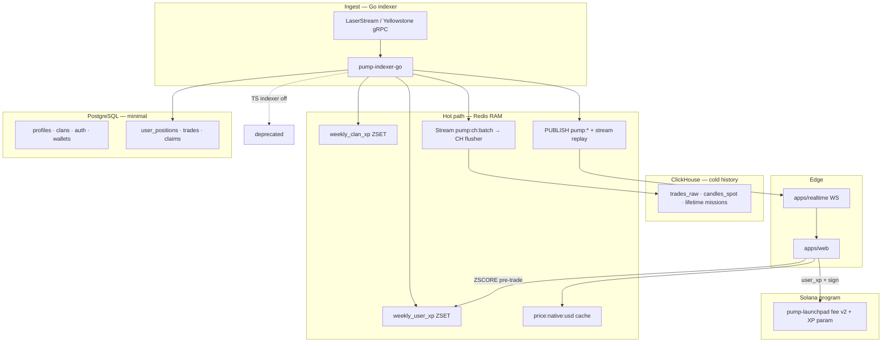
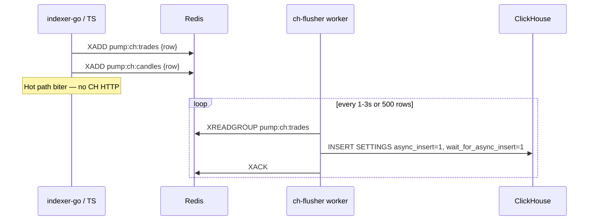
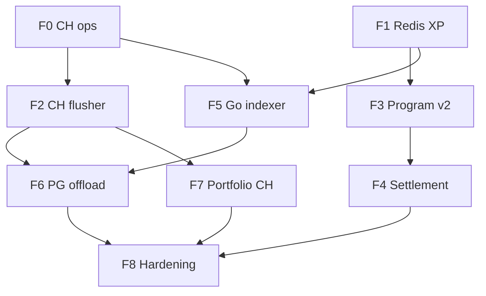

# Güncelleme Master Plan — Redis-First · LaserStream · Go Indexer

**Versiyon:** 1.0  
**Tarih:** 2026-07-23  
**Owner:** Platform engineering  
**Kaynak vizyon:** [`guncelleme.md`](../guncelleme.md) · [`guncelleme2.md`](../guncelleme2.md) · [`guncelleme3.md`](../guncelleme3.md)  
**Analiz:** [`guncelleme-analiz-ve-plan.md`](./guncelleme-analiz-ve-plan.md)  
**Mevcut mimari:** [`proje-mimari-2026.md`](./proje-mimari-2026.md)  
**İlerleme günlüğü:** [`guncelleme-ilerleme.md`](./guncelleme-ilerleme.md) ← **her faz sonrası buraya yaz**

---

## 0. North Star (hedef durum)



### Katman sorumlulukları (kilit kararlar)

| Katman | SSOT | Asla |
|--------|------|------|
| **Positions / P/L** | PostgreSQL | CH veya Redis |
| **Haftalık XP / leaderboard** | Redis ZSET | PG aggregate, CH hot query |
| **Canlı board / chart tip** | Redis + WS | PG poll, UI RPC |
| **Chart history (HTTP)** | ClickHouse `candles_spot` / `trades_raw` | PG (7 gün parity sonrası kapat) |
| **Lifetime missions (Volume Monster)** | CH + PG audit | — |
| **Trade öncesi XP** | Redis `ZSCORE` | ClickHouse sorgu ([`guncelleme.md`](../guncelleme.md) **reddedildi**) |
| **Ingest** | Go + LaserStream gRPC | RPC `onLogs` (cutover sonrası) |

### Araştırma kaynakları (doğrulanmış)

| Konu | Kaynak |
|------|--------|
| LaserStream gRPC | [Helius LaserStream docs](https://www.helius.dev/docs/laserstream) · [Quickstart](https://www.helius.dev/docs/laserstream/grpc) · [laserstream-sdk](https://github.com/helius-labs/laserstream-sdk) (Go/TS/Rust) |
| Yellowstone uyumluluk | Wire-compatible; `@triton-one/yellowstone-grpc` veya Helius SDK |
| Self-hosted alternatif | [yellowstone-grpc](https://github.com/rpcpool/yellowstone-grpc) — [`solana-stack-plan.md`](./solana-stack-plan.md) B |
| CH async insert | [ClickHouse async_insert](https://clickhouse.com/docs/optimize/asynchronous-inserts) — **`async_insert=1, wait_for_async_insert=1`** (guncelleme2’deki `wait=0` **prod’da kullanılmayacak**) |
| Redis ZSET | `ZINCRBY`, `ZREVRANGE`, `RENAME` — sezon [`guncelleme3.md`](../guncelleme3.md) |
| Mevcut TS indexer | `apps/indexer-sol` — cutover’a kadar paralel |
| VM Go | `go1.25` — [`solana-stack-plan.md`](./solana-stack-plan.md) |

---

## 1. Faz haritası (özet)

| Faz | Ad | Süre tahmini | Bloker |
|-----|-----|--------------|--------|
| **F0** | Spec kilidi + CH ops düzeltme | 3–5 gün | — |
| **F1** | Redis weekly XP + clans + season cron | 1–2 hf | F0 |
| **F2** | CH stabilize + Redis→CH flusher | 1 hf | F0 |
| **F3** | Program fee v2 + cashback + UI XP | 2–4 hf | F1 |
| **F4** | Sezon settlement + on-chain havuzlar | 2–3 hf | F3 |
| **F5** | Go indexer + LaserStream gRPC | 2–4 hf | F1, F2 |
| **F6** | TS indexer cutover + PG XP offload | 1 hf | F5, F1 |
| **F7** | Jupiter price worker + portfolio CH tab | 1 hf | F2, F5 |
| **F8** | Prod hardening + 7d parity gate | sürekli | tümü |

**hf** = hafta (1 dev, full-time eşdeğeri)

---

## 2. F0 — Spec kilidi + ClickHouse ops (ÖNCELİK: VM)

> **VM gerçeği (2026-07-22):** CH container healthy ama `candles_spot` boş, sorgular OOM, chart `olap:postgres`. Bu faz **bloker** — sonraki fazlar CH’ye güvenemez.

### 2.1 Deliverables

- [ ] `docs/fee-split-v2-spec.md` — 6-way BPS + PDA listesi + claim IX
- [ ] `docs/redis-key-catalog.md` — tüm key’ler, TTL, rename kuralları
- [ ] `docs/ingest-cutover-runbook.md` — TS→Go geçiş checklist
- [ ] CH `memory.xml` → `max_server_memory_usage_to_ram_ratio ≥ 0.55`
- [ ] Backfill: `backfill-clickhouse-candles` + `backfill-clickhouse-trades`
- [ ] `check-chart-parity` → `compared_ch > 0`

### 2.2 Komutlar (VM)

```bash
# memory fix
nano /var/www/pump/tma/deploy/clickhouse/config/memory.xml
docker compose -f deploy/clickhouse/docker-compose.yml up -d clickhouse

# backfill
cd /var/www/pump/tma && npm run build -w @pump/indexer-sol
npm run backfill-clickhouse-candles -w @pump/indexer-sol
npm run backfill-clickhouse-trades -w @pump/indexer-sol
npm run check-chart-parity -w @pump/indexer-sol
```

### 2.3 Kabul kriterleri

| Metrik | Hedef |
|--------|-------|
| `SELECT count() FROM pump.candles_spot` | OOM yok |
| `compared_ch` (parity) | ≥ 1 |
| pm2 log `chart_olap_source` | `candles_spot` veya `trades_raw` (postgres değil) |

### 2.4 Rollback

- `USE_CLICKHOUSE_CANDLES=false` web `.env`
- PG mirror açık kalır (`SKIP_PG_TOKEN_CANDLES` unset)

**→ İlerleme:** [`guncelleme-ilerleme.md`](./guncelleme-ilerleme.md#f0)

---

## 3. F1 — Redis weekly XP + clans + sezon

**Amaç:** Haftalık yarışma RAM’de; PG’ye XP aggregate yükü yok. TS indexer ile başla (Go gelene kadar).

### 3.1 Redis key katalogu (draft)

| Key | Tip | Yazan | Okuyan |
|-----|-----|-------|--------|
| `weekly_user_xp` | ZSET | indexer | `/api/xp/weekly`, TradePanel pre-trade |
| `weekly_clan_xp` | ZSET | indexer, missions API | leaderboard |
| `season:current` | HASH `{id, start, end}` | cron | tüm servisler |
| `season:{id}:claims_open` | STRING bool | settlement worker | claim UI |
| `weekly_user_xp_season_{id}` | ZSET | cron RENAME | settlement audit |

### 3.2 PostgreSQL (minimal — sadece statik)

```sql
-- db/migrations/054_clans.sql (draft)
clans (id, name, leader_address, created_at)
clan_members (clan_id, wallet_address, role, joined_at)
```

PG **yapmaz:** haftalık XP toplama, leaderboard `SUM()`, sezon sıfırlama.

### 3.3 Indexer (TS geçici — F5’e kadar)

Dosya: `apps/indexer-sol/src/weekly-xp.ts`

```text
Trade confirmed → compute xp_earned →
  ZINCRBY weekly_user_xp {wallet} {xp}
  ZINCRBY weekly_clan_xp {clan_id} {xp}  (if member)
```

XP formülü spec: `docs/fee-split-v2-spec.md` eki veya `docs/xp-economics.md`.

### 3.4 API

| Route | Kaynak |
|-------|--------|
| `GET /api/xp/weekly?address=` | Redis `ZSCORE` |
| `GET /api/leaderboard/weekly?limit=` | `ZREVRANGE` |
| `GET /api/clans/...` | PG + Redis overlay |

### 3.5 Sezon cron (guncelleme3)

```text
Pazar 23:59:59 UTC:
  RENAME weekly_user_xp → weekly_user_xp_season_{N}
  RENAME weekly_clan_xp → weekly_clan_xp_season_{N}
  CREATE fresh weekly_user_xp, weekly_clan_xp
  INCR season:current.id
```

Script: `scripts/season-rename-cron.ts` + systemd timer `pump-season-cron.timer`

### 3.6 Missions Tür A (off-chain)

X/TG onay → API → `ZINCRBY` both ZSETs (PG sadece audit log).

### 3.7 Kabul kriterleri

- [ ] Leaderboard API p95 < 5ms (Redis local)
- [ ] Trade sonrası XP Redis’te artıyor (integration test)
- [ ] Pazartesi 00:00 UTC sonrası `ZSCORE` = 0 yeni sezon
- [ ] PG `users.points` **henüz** leaderboard UI’da kullanılmıyor (weekly)

### 3.8 Rollback

- Feature flag `USE_REDIS_WEEKLY_XP=false` → PG leaderboard fallback

**→ İlerleme:** [`guncelleme-ilerleme.md`](./guncelleme-ilerleme.md#f1)

---

## 4. F2 — CH stabilize + Redis→CH flusher (CH yükünü indexer’dan al)

**Amaç:** guncelleme2 vizyonu — indexer CH’ye **doğrudan** yazmaz; Redis Stream buffer + async worker.

### 4.1 Mimari



### 4.2 Deliverables

- [ ] `apps/ch-flusher/` — Node veya Go worker (tercihen Go, indexer repo içinde)
- [ ] Redis streams: `pump:ch:trades`, `pump:ch:candles`
- [ ] CH user config: `async_insert=1`, `wait_for_async_insert=1` ([ClickHouse docs](https://clickhouse.com/docs/optimize/asynchronous-inserts))
- [ ] Indexer: `enqueueTradeClickHouse` → `XADD` (TS’de geçiş; Go’da native)
- [ ] Metrik: flusher lag (stream length), insert error rate

### 4.3 CH read path (web)

- `USE_CLICKHOUSE_CANDLES=true` (VM’de var)
- Öncelik: `candles_spot` → `trades_raw` aggregate ([`candles.ts`](../apps/web/src/lib/clickhouse/candles.ts))
- 7 gün `check-chart-parity` green → `SKIP_PG_TOKEN_CANDLES=true`

### 4.4 Kabul kriterleri

- [ ] Indexer trade path’te CH HTTP yok (grep verify)
- [ ] Flusher lag p95 < 5s
- [ ] `compared_ch == compared_pg` (parity)
- [ ] Chart `olap != postgres` 95%+ requests

**→ İlerleme:** [`guncelleme-ilerleme.md`](./guncelleme-ilerleme.md#f2)

---

## 5. F3 — On-chain program fee v2 + cashback

**Bağımlılık:** F1 (Redis XP pre-trade)

### 5.1 Program değişiklikleri (`programs/pump-launchpad`)

| Değişiklik | Detay |
|------------|-------|
| IX data | `buy`/`sell` + `user_xp: u32` (LE) |
| Fee split | 6-way — [`guncelleme-analiz-ve-plan.md` §4](./guncelleme-analiz-ve-plan.md) |
| Yeni PDA | `cashback-fees`, `season-accrual`, `clan-pool-accrual` (spec doc) |
| Yeni IX | `claim_cashback_fees`, `claim_season_rewards` (F4) |
| Cashback rule | `user_xp >= 1000` → %0.1250 hacim → PDA |

### 5.2 SDK + web

- `@pump/solana-sdk` — encode/decode, PDA helpers
- `TradePanel` — pre-trade `GET /api/xp/weekly` → tx `user_xp`
- **Anti-spoof:** cap `user_xp` max; indexer audit; anomali flag (PG audit table only)

### 5.3 Indexer events

- Extend `FeeSplit` / new `CashbackAccrued` → decode Go + TS

### 5.4 Kabul kriterleri

- [ ] Devnet: XP≥1000 trade → cashback PDA > 0
- [ ] Devnet: XP<1000 → cashback PDA unchanged
- [ ] Creator/referrer claim hâlâ çalışıyor (regression)
- [ ] WSL `wsl-pinocchio-build.sh` + native math tests

**→ İlerleme:** [`guncelleme-ilerleme.md`](./guncelleme-ilerleme.md#f3)

---

## 6. F4 — Sezon settlement + haftalık havuz claim

**Bağımlılık:** F3 (on-chain accrual buckets)

### 6.1 Akış (guncelleme3)

```text
1. Cron RENAME (F1) — anlık
2. Settlement worker (async, 0–12h):
   - Read weekly_*_season_{N} from Redis
   - Top 100 user XP, top 3 clan XP
   - Klan içi split: lidere %20, üyelere XP ağırlığı %80
3. Chunked on-chain txs → season allocation PDAs
4. SET season:{N}:claims_open = true @ Pazartesi 12:00 UTC
5. UI claim modals
```

### 6.2 Deliverables

- [ ] `apps/settlement-worker/` — Go (PG audit + Redis read + Solana tx batch)
- [ ] `season_settlement_runs` PG table (audit only)
- [ ] Admin pause / replay runbook

### 6.3 Kabul kriterleri

- [ ] Sezon geçişinde canlı trade kesintisiz (load test)
- [ ] Claim açılmadan UI claim button disabled
- [ ] On-chain claim = PDA exact amount (program test)

**→ İlerleme:** [`guncelleme-ilerleme.md`](./guncelleme-ilerleme.md#f4)

---

## 7. F5 — Go indexer + LaserStream gRPC (TS rewrite)

**Amaç:** `apps/indexer-sol-go` — multi-core decode, gRPC ingest, Redis-first writes.

### 7.1 Repo yapısı (yeni)

```text
apps/indexer-sol-go/
├── cmd/indexer/main.go
├── internal/
│   ├── geyser/          # LaserStream / yellowstone client
│   ├── decode/          # pump launchpad events (port from TS)
│   ├── pg/              # positions, trades, bonding (sqlc)
│   ├── redis/           # ZINCRBY, PUBLISH, XADD ch streams
│   └── metrics/         # prometheus / structured log
├── go.mod
└── README.md
```

### 7.2 Geyser bağlantı

**Devnet (hızlı başlangıç):**

```text
SOLANA_GEYSER_ENDPOINT=https://laserstream-devnet-ewr.helius-rpc.com
SOLANA_GEYSER_TOKEN=<HELIUS_API_KEY>
```

Kaynak: [Helius LaserStream Quickstart](https://www.helius.dev/docs/laserstream/grpc)

**SDK seçenekleri:**

| SDK | Not |
|-----|-----|
| [helius-labs/laserstream-sdk](https://github.com/helius-labs/laserstream-sdk) Go | Auto-reconnect, slot replay |
| `@triton-one/yellowstone-grpc` (Go port) | Wire-compatible drop-in |

Subscription filter: `pump-launchpad` program ID transactions + logs.

### 7.3 Yazım matrisi (Go indexer)

| Event | PG | Redis | CH stream |
|-------|-----|-------|-----------|
| Trade | ✅ trades, positions, bonding | ZINCRBY XP, PUBLISH, hot candle | XADD |
| TokenCreated | ✅ tokens | PUBLISH board | — |
| FeeClaim | ✅ claims | — | — |
| Points/missions | audit row only | ZINCRBY (weekly) | XADD lifetime |

### 7.4 Paralel çalışma (cutover öncesi)

```text
Phase 5a: Go read-only — decode + metrics, no writes (1 hf)
Phase 5b: Go shadow writes — Redis only, compare TS (3 gün)
Phase 5c: Go primary PG+Redis, TS standby (1 hf)
Phase 5d: TS indexer stop (F6)
```

### 7.5 Kabul kriterleri

- [ ] gRPC reconnect + slot replay test (kill switch)
- [ ] Decode parity: 1000 tx sample TS vs Go (same event fields)
- [ ] WS board latency p95 ≤ TS baseline
- [ ] CPU indexer process < TS baseline at 2× trade rate (load test)

### 7.6 Rollback

- `systemctl stop pump-indexer-sol-go && systemctl start pump-indexer-sol`
- Env `SOLANA_INDEXER_SOURCE=rpc` (TS fallback)

**→ İlerleme:** [`guncelleme-ilerleme.md`](./guncelleme-ilerleme.md#f5)

---

## 8. F6 — PG yük offload + TS indexer emekli

### 8.1 PG’den kaldırılacaklar

| Kaldır | Kalır |
|--------|-------|
| Haftalık XP leaderboard queries | `user_positions`, `trades`, `bonding_states` |
| `launchpad_award_points` on every trade (weekly portion) | Claim history, clans, auth |
| `token_candles` write (after parity) | Audit: `launchpad_points_sync_log` |

### 8.2 Deliverables

- [ ] `SKIP_PG_TOKEN_CANDLES=true` (indexer env)
- [ ] Missions: weekly → Redis only; lifetime → CH + PG audit
- [ ] Disable `apps/indexer-sol` systemd; enable `pump-indexer-sol-go`
- [ ] Update `deploy/tma-deploy.sh`, `docs/ops-perf-playbook.md`

### 8.3 Kabul kriterleri

- [ ] PG CPU trade peak’te ≥30% düşüş (VM metrics)
- [ ] 7 gün parity + zero chart drift incidents
- [ ] Rollback runbook tested once

**→ İlerleme:** [`guncelleme-ilerleme.md`](./guncelleme-ilerleme.md#f6)

---

## 9. F7 — Jupiter price worker + portfolio CH tab

### 9.1 Price worker

```text
Worker (Go veya cron) → Jupiter Price API → SET price:native:sol:usd EX 60
Web → GET /api/price/native (Redis) → client-side USD multiply
```

Fallback: mevcut Binance/CG (`native-usd.ts`) — Jupiter primary değil backup.

### 9.2 Portfolio

| API | Kaynak |
|-----|--------|
| Claim balances | PG + on-chain PDA |
| Holdings | Helius DAS / existing on-chain scan |
| Trade history tab | CH `trades_raw` (PG fallback) |

**→ İlerleme:** [`guncelleme-ilerleme.md`](./guncelleme-ilerleme.md#f7)

---

## 10. F8 — Prod hardening (sürekli)

- [ ] Weekly SLO ritual — [`ops-perf-playbook.md`](./ops-perf-playbook.md)
- [ ] `check-chart-parity` daily cron
- [ ] Redis memory maxmemory-policy
- [ ] Go indexer pprof + trace
- [ ] Load test: 500 concurrent WS, 100 trades/min
- [ ] Security: XP spoof audit, settlement multisig review

---

## 11. Bağımlılık grafi



---

## 12. Risk register (master)

| ID | Risk | Faz | Mitigasyon |
|----|------|-----|------------|
| R1 | CH OOM (VM yaşandı) | F0 | memory.xml + scoped queries |
| R2 | Dual-write CH boş | F0,F2 | backfill + flusher metrics |
| R3 | UI XP spoof | F3 | program cap + audit |
| R4 | Sezon cron fail | F1,F4 | idempotent RENAME + manual runbook |
| R5 | Go decode drift | F5 | shadow mode + parity tests |
| R6 | LaserStream outage | F5 | TS RPC fallback systemd |
| R7 | CH fire-and-forget data loss | F2 | `wait_for_async_insert=1` |
| R8 | PG positions regression | F6 | never skip positions path |

---

## 13. İlk 2 sprint (hemen başla)

### Sprint A (hafta 1)

1. F0 CH memory + backfill + parity green
2. F1 migration `054_clans.sql` + Redis keys + `/api/xp/weekly`
3. `docs/redis-key-catalog.md` + `docs/fee-split-v2-spec.md` draft

### Sprint B (hafta 2)

1. F1 season cron + leaderboard UI
2. F2 ch-flusher scaffold + TS indexer XADD path
3. F5 `apps/indexer-sol-go` repo scaffold + LaserStream devnet connect (read-only)

---

## 14. Doküman güncelleme kuralı

Her faz **DONE** olunca:

1. [`guncelleme-ilerleme.md`](./guncelleme-ilerleme.md) — log entry (tarih, commit, env, komutlar, sorunlar)
2. Bu dosyada faz checkbox `[x]`
3. [`proje-mimari-2026.md`](./proje-mimari-2026.md) — mimari delta (gerekirse)

**Sorun çıkınca:** ilerleme MD’de `INCIDENT` bloğu aç — kök neden + fix + hangi faz commit’i.
