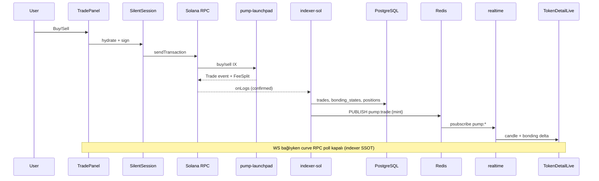
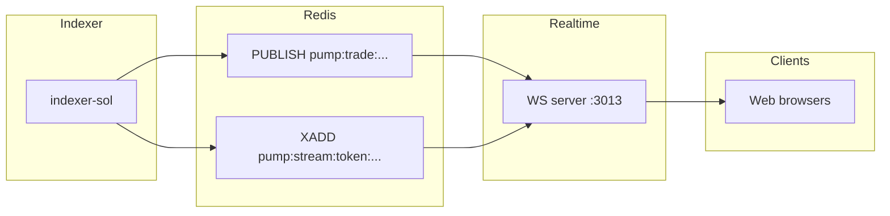
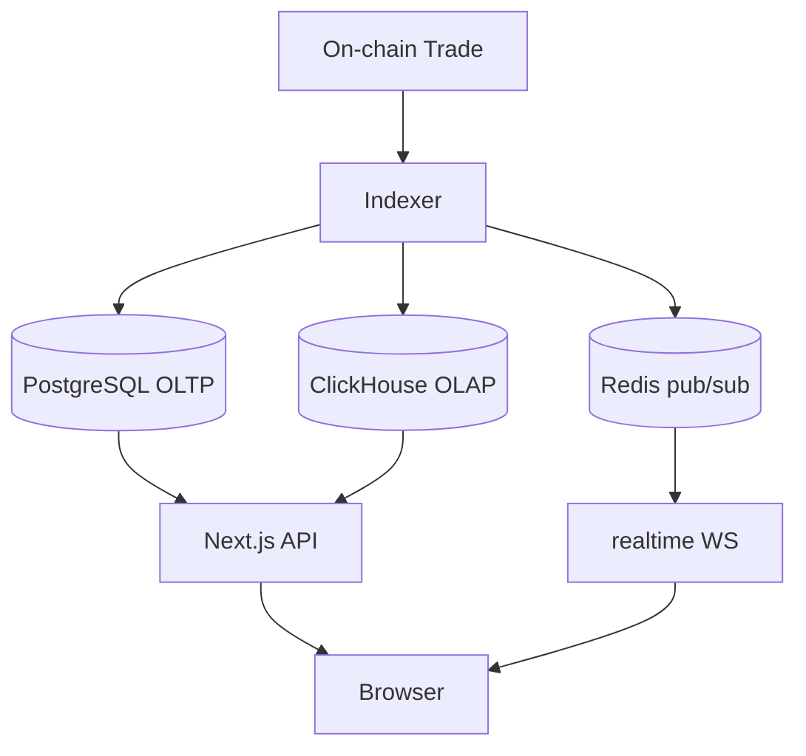
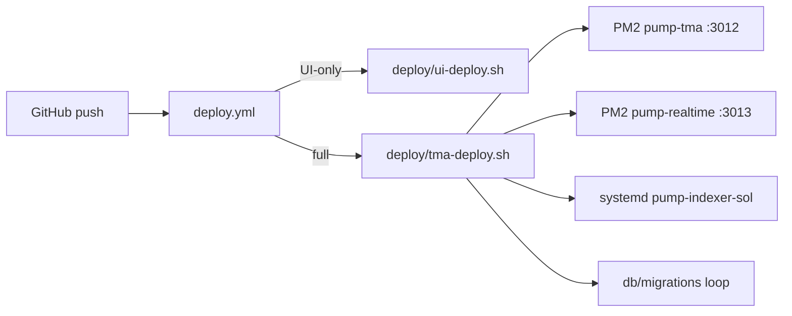

# Pump TMA — Proje Mimarisi (A→Z)

**Tarih:** 2026-07-23  
**Amaç:** Mevcut monorepo’nun üretimdeki gerçek yapısını — UI/UX, API, DB, Redis, WS, indexer, Solana program — tek referans dokümanda toplamak.  
**İlgili:** [`repo-structure.md`](./repo-structure.md) · [`ops-perf-playbook.md`](./ops-perf-playbook.md) · [`solana-port.md`](./solana-port.md) · [`chart-architecture.md`](./chart-architecture.md)

---

## 1. Monorepo haritası

```text
pump-tma/
├── apps/
│   ├── web/           @pump/web       Next.js 16 — tüketici UI + App Router API
│   ├── admin/         @pump/admin      Vite admin konsolu (MetaMask, nginx /admin/)
│   ├── indexer/       @pump/indexer    EVM log indexer (Base) — Solana cutover’da kapalı
│   ├── indexer-sol/   @pump/indexer-sol Solana log indexer → PG + Redis + opsiyonel CH
│   └── realtime/      @pump/realtime   WebSocket fan-out (PM2 :3013)
├── packages/solana-sdk/               PDA seed, IX tags, PUMP_FEEL_DEFAULTS
├── programs/pump-launchpad/           Pinocchio tek program (bonding + AMM mode-switch)
├── db/migrations/                     PostgreSQL şema evrimi
├── deploy/                            VM deploy, ClickHouse compose, nginx
└── docs/                              Mimari, ops, port planları
```

**Production VM:** `104.207.64.115:22022` · Web `:3012` · Realtime `:3013` · systemd `pump-indexer-sol`

---

## 2. Uygulama katmanları

### 2.1 Web (`apps/web`)

| Alan | Teknoloji / pattern |
|------|---------------------|
| Framework | Next.js 16 App Router, React 19 |
| Stil | `globals.css` + `pump-*` token’ları — shadcn/MUI yok |
| Auth | Telegram OIDC, email, custodial Solana/EVM cüzdan |
| Chain | `NEXT_PUBLIC_CHAIN_FAMILY=solana` (prod cutover) |
| State | TanStack Query, client islands, SSR + cache tags |
| Charts | TradingView Lightweight Charts v5 |
| WS client | `useLiveChannel` → `NEXT_PUBLIC_WS_URL` |

**Ana sayfalar**

| Route | Bileşen | Canlı veri |
|-------|---------|------------|
| `/` Arena | `ArenaBoard`, token kartları | PG + Redis arena cache + WS `arena` |
| `/token/[address]` | `TokenDetailLive` | PG seed + WS `token:{addr}` + bonding machine |
| `/portfolio` | `PortfolioPanel` | PG positions + on-chain pending fees + WS `wallet:{addr}` |
| `/missions` | `MissionsPanel` | PG `launchpad_*` tasks + points |
| `/create` | `CreateMemeFormSolana` | Silent sign + launchpad program |

**Trade akışı (Solana)**



### 2.2 Realtime (`apps/realtime`)

- **Port:** 3013 (PM2 `pump-realtime`)
- **Redis:** `PSUBSCRIBE pump:*` + stream replay `pump:stream:{room}`
- **Odalar:** `arena`, `token:{address}`, `wallet:{address}`
- **Replay:** Son ~40 stream entry subscribe anında



### 2.3 Indexer Solana (`apps/indexer-sol`)

| Özellik | Durum |
|---------|--------|
| Kaynak | **RPC `onLogs`** (default) — factory/curve/treasury program ID |
| LaserStream | **Stub** — endpoint set edilse bile RPC fallback |
| Yazım | PostgreSQL (OLTP), Redis publish, opsiyonel ClickHouse dual-write |
| Missions | `PointsBridge` → `launchpad_award_points()` trade/create eşiklerinde |
| systemd | `pump-indexer-sol` |

**Decode edilen event’ler:** `TokenCreated`, `Trade`, `FeeSplit`, `ReferrerSet`, `CreatorFeeClaimed`, `ReferrerFeeClaimed`

### 2.4 Admin (`apps/admin`)

- Vite SPA, nginx static `/admin/`
- EVM ops (airdrop sweep, emergency) + Solana admin API’leri
- Ana web’de `/admin` route yok

---

## 3. Solana program (`programs/pump-launchpad`)

**Program ID:** `Hwv85kSodkR34rBTE1J67aSzixnAkXdAX6HzZnKDCvus`  
**Model:** Pinocchio — bonding curve (`complete=0`) → flip sonrası AMM (`complete=1`)

### 3.1 Fee ekonomisi (mevcut)

| Parametre | Değer | Trade hacmine etkisi |
|-----------|-------|----------------------|
| `protocolFeeBps` | 125 | Toplam fee **%1.25** |
| `creatorFeeShareBps` | 2400 | Fee havuzunun **%24** → ~**%0.30** hacim |
| `referrerShareBps` | 1000 | Fee havuzunun **%10** → ~**%0.125** hacim |
| Kalan | — | Anında `protocol_treasury` PDA |

Creator/referrer payları **PendingFees PDA**’da birikir; **manuel claim** (`claim_creator_fees` / `claim_referrer_fees`).

### 3.2 PDA envanteri

| PDA | Seed | Rol |
|-----|------|-----|
| Global | `global` | Authority, fee BPS, liquidity pointer |
| Curve | `curve`, mint | Virtual/real reserves, complete flag |
| Liquidity vault | `vault` | Paylaşımlı SOL kasası |
| Protocol treasury | `protocol-treasury` | Protokol payı |
| Creator pending | `creator-fees`, owner | Claim edilebilir creator fee |
| Referrer pending | `referrer-fees`, owner | Claim edilebilir referrer fee |
| Referrer binding | `referrer`, trader | Lifetime referrer |

### 3.3 Claim güvenliği

- Miktar client’tan gelmez — PDA `pending_lamports` okunur
- Claimer signer + PDA owner eşleşmesi zorunlu
- Atomik: pending sıfırlanır → liquidity’den claimer’a transfer

---

## 4. PostgreSQL (OLTP — source of truth)

**Bağlantı:** `LAUNCHPAD_DATABASE_URL` (+ read replica `LAUNCHPAD_DATABASE_READ_URL`, PgBouncer VM’de)

### 4.1 Launchpad çekirdek

| Tablo | Rol |
|-------|-----|
| `tokens` | Token meta, status (`BONDING`/`GRADUATED`/`PAUSED`) |
| `bonding_states` | reserve, token_sold, progress_bps, curve_complete, vault_token_reserve |
| `trades` | Her fill — positions/chart kaynağı |
| `user_positions` | **P/L / cost basis SoT** |
| `user_volumes` | Hacim rollup |
| `token_board_stats` | Arena sıralama aggregate |
| `token_candles` | OHLC fallback (CH kapalıyken) |
| `creator_fee_claims` / `referrer_fee_claims` | Claim geçmişi (indexer event) |
| `referral_bindings` | Referrer eşleşmeleri |
| `indexer_state` | Solana indexer cursor |

### 4.2 Kullanıcı / auth

| Tablo | Rol |
|-------|-----|
| `users` | points, points_lifetime |
| `solana_wallets` | AES şifreli custodial key |
| `telegram_wallets`, `oauth_wallets`, `email_wallets` | Login bağları |

### 4.3 Missions / incentives

| Tablo / fn | Rol |
|------------|-----|
| `launchpad_tasks` | Görev tanımları |
| `launchpad_user_task_completions` | Tamamlanan görevler |
| `launchpad_user_daily_completions` | Günlük swap vb. |
| `launchpad_award_points()` | Atomik puan yazımı |
| `referral_invite_xp_claims` | Referral milestone claim |
| `points_inventory` / `points_redemptions` | Perk market |

**Mevcut görevler (seed):** Daily Swap (20), Deploy Meme (200), First Smart Buy (100), Volume Monster (300), Referral Invite XP (50/invite)

### 4.4 Sosyal / growth

`creator_follows`, `token_favorites`, `token_announcements`, `airdrops` (+ claim tabloları), `king_history`

### 4.5 Olmayan (henüz)

- **Klan tabloları** — yok
- **Haftalık sezon / weekly XP** — yok (PG `users.points` lifetime + mission bazlı)
- **On-chain cashback PDA** — yok

---

## 5. Redis

| Kullanım | Key / kanal | Yazan | Okuyan |
|----------|-------------|-------|--------|
| WS pub/sub | `pump:board`, `pump:trade:{token}`, `pump:wallet:{wallet}` | indexer-sol | realtime |
| Stream replay | `pump:stream:{room}` | indexer-sol | realtime (subscribe replay) |
| Trade seq | `pump:seq:trade:{token}` | indexer-sol | web (opsiyonel) |
| Arena cache | `pump:cache:arena:*` | web API | web API |
| Hot candle/tape | `pump:hot:candle:*`, hot tape keys | indexer-sol | web chart API |

**Flag:** `REDIS_PUBLISH_ENABLED=true` (indexer-sol) — canlı board için zorunlu  
**Flag:** `USE_REDIS_ARENA_CACHE` (web) — arena PG yükünü azaltır

**Olmayan:** `weekly_user_xp`, `weekly_clan_xp` ZSET’leri

---

## 6. ClickHouse (OLAP — opsiyonel)

**Durum:** Kod hazır; VM’de `bash deploy/vm/enable-clickhouse.sh` ile aktive edilir.

| Parça | Path |
|-------|------|
| Compose + schema | `deploy/clickhouse/` |
| Dual-write | `apps/indexer-sol/src/clickhouse.ts` |
| Chart read | `apps/web/src/lib/clickhouse/candles.ts` |
| Flag | `USE_CLICKHOUSE_CANDLES=true`, `CLICKHOUSE_DUAL_WRITE=true` |

**Rol:** Trades/OHLCV geçmişi — **positions/wallets PG’de kalır** (hybrid locked).



---

## 7. UI/UX mimarisi

### 7.1 Design system

- Kaynak: `.cursor/skills/pump-tma-design-system`, `globals.css`
- Nav: üst bar + mobil bottom bar (sol sidebar yok)
- Token logo: kare tile; avatar: daire
- Portfolio: Launched=Holdings grid, Earnings=`PortfolioEarningsCard`

### 7.2 Canlı veri stratejisi

| Yüzey | SSOT | Fallback |
|-------|------|----------|
| Arena fiyat/mcap | WS bonding + PG | HTTP poll (WS kopuk) |
| Token sayfa progress/graduated | WS + PG (`progress_bps`, `GRADUATED`) | RPC poll kapalı (WS açıkken) |
| Chart OHLC | CH veya PG + Redis hot tip | Tape replay |
| Portfolio positions | PG `user_positions` | On-chain balance scan |
| Pending creator/referrer fees | **On-chain PDA** | — |
| Claimed fees history | PG `*_fee_claims` | Indexer catch-up |

### 7.3 USD gösterimi

- DB’de kalıcı USD fiyatı **saklanmaz** (trade anında `native_usd_rate` snapshot var)
- Canlı USD: Binance/CoinGecko cache (`useBnbUsdPrice` / native USD hook)
- Client-side çarpım — **Jupiter Price worker yok**

---

## 8. API yüzeyi (özet)

| Endpoint grubu | Veri kaynağı |
|----------------|--------------|
| `/api/tokens`, `/api/tokens/[addr]` | PG + bonding join |
| `/api/candles` | CH → PG MV → Redis hot merge |
| `/api/portfolio` | PG positions, volumes, created tokens |
| `/api/portfolio/wallet-holdings` | On-chain SPL scan (platform mint’leri) |
| `/api/missions` | PG incentive + lazy award checks |
| `/api/creators/[addr]/profile` | PG + on-chain pending fees RPC |
| `/api/health` | PG ping + flags |

---

## 9. Deploy & CI



---

## 10. EVM legacy (referans)

- `contracts/` + `apps/indexer` — Base UUPS launchpad
- Solana cutover sonrası VM’de EVM indexer **kapalı**
- Web kodu `isSolanaChainFamily` ile dallanır; EVM path hâlâ repo’da

---

## 11. Bilinçli ertelenen kapılar

[`ops-perf-playbook.md`](./ops-perf-playbook.md) SLO ihlali olmadan açılmaz:

| Kapı | Koşul |
|------|-------|
| ClickHouse prod | Chart/trades scale — script hazır |
| Zero (Rocicorp) | Favorites/portfolio cross-device yavaş |
| Edge WS | WS > 2000 concurrent |
| PG 18 pg_trickle | CPU > 70% MV driven |
| Yellowstone gRPC | LaserStream stub yerine self-hosted Geyser |

---

## 12. Tek cümle özet

**Pump TMA bugün:** Solana Pinocchio launchpad + TypeScript indexer → PostgreSQL (positions/truth) + Redis/WS (canlı UI) + opsiyonel ClickHouse (chart history); fee claim on-chain PDA; missions PG points; klan/haftalık XP/cashback/on-chain sezon ödülleri **henüz yok**.
